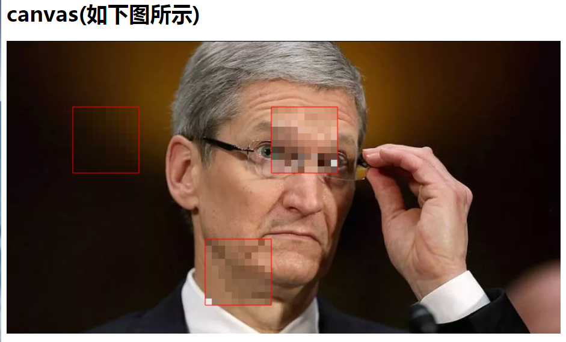

# watermark-image
watermarkImage.js是图片水印组件，降低数据泄密风险。目前只支持马赛克，后续会研发用于其他地方

## 1、图片水印插件原理

1、创建一个image对象对图片进行加载；

2、加载成功后，将图片写入canvas画布中；

3、然后从画布中取出图片的所有像素点，取出打马赛克位置的RGB值来画马赛克。


## 2、图片水印插件--使用

2.1本地引入封装的js文件

不需要引用jquery，watermarkImage.js是必须引入的组件。

第一步： ```git clone https://github.com/saucxs/watermark-image.git```

第二步： 在需要加载图片的地方，是file文件对象，引入```watermarkImage.js```文件

第三步：在确保dom加载完毕之后，

```
var img = new DealImage({
                target: "#canvas",
                mosaicSize: 10,
                image: this.files[0]
            })

            img.draw({
                type: "image/png",
                mosaic: {
                    position: [
                        {start: [100, 100], end: [200, 200]},
                        {start: [400, 100], end: [500, 200]},
                        {start: [300, 300], end: [400, 400]},
                    ],
                },
                frame: {
                    position: [
                        {start: [100, 100], end: [200, 200]},
                         {start: [400, 100], end: [500, 200]},
                        {start: [300, 300], end: [400, 400]},
                    ],
                    color: "red"
                },
                callback: function(imgBase64, filename) {
                    let imgEle = document.querySelector("img");
                    imgEle.src = imgBase64;

                }
            })

```

## 3、图片水印插件-testTool（测试工具）

欢迎访问：https://www.mwcxs.top/static/testTool/image/index.html

## 4、版本功能
+ v1.1 下一版本解决问题
   - 1、支持图片的url地址
   - 2、支持相应位置，而不是绝对位置


+ v1.0  2019.01.29
   - 1、处理图片-指定图片的位置生成马赛克
   - 2、支持file对象

## 5、测试工具截图

